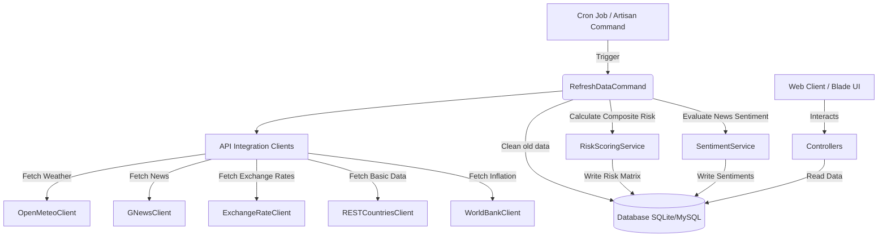

# 🌐 Global Supply Chain Risk Intelligence Platform

[](https://laravel.com)
[](https://php.net)
[](file:///d:/ProjekFullStack/global-scm/LICENSE)
[](https://vite.dev)

Platform Intelijen Risiko Rantai Pasok Global (Global Supply Chain Risk Intelligence Platform) adalah sistem berbasis web modern yang dirancang untuk melacak, menganalisis, dan memvisualisasikan faktor risiko logistik, cuaca, ekonomi, dan berita global. 

Sistem ini membantu manajer rantai pasok dalam memantau kesehatan operasional negara-negara mitra dagang melalui indeks risiko komposit yang diperbarui secara dinamis.

---

## 🚀 Fitur Utama

- **Analisis Risiko Multi-Negara**: Dashboard interaktif yang menampilkan tingkat risiko keseluruhan (*Low*, *Medium*, *High*) dengan rincian parameter pendukung.
- **Peta Interaktif Pelabuhan (Leaflet.js)**: Visualisasi geografis pelabuhan utama di 20 negara lengkap dengan data status operasional, kapasitas kontainer, dan indikator risiko.
- **Sentiment Analysis Berita Berbasis Leksikon (Lexicon-based)**: Mengunduh berita logistik & perdagangan dunia kemudian menghitung sentimen (*Positive*, *Neutral*, *Negative*) secara dinamis berdasarkan kamus kata yang dikonfigurasi.
- **Integrasi API Multi-Sumber Terpadu**:
  - **Open-Meteo API**: Memantau cuaca ekstrem (curah hujan, kecepatan angin, probabilitas badai).
  - **World Bank API**: Mengambil data indikator ekonomi makro seperti inflasi tahunan.
  - **GNews API**: Sinkronisasi artikel berita global dan lokal real-time.
  - **ExchangeRate API**: Melacak fluktuasi nilai tukar mata uang asing terhadap USD.
  - **REST Countries API**: Sinkronisasi data dasar geografis negara (kapital, bendera, bahasa, kordinat).
- **Perbandingan Samping-ke-Samping (Side-by-Side Comparison)**: Membandingkan metrik risiko dan ekonomi dari beberapa negara sekaligus untuk mempermudah keputusan logistik alternatif.
- **Watchlist Kustom**: Menyimpan daftar pantauan negara prioritas (dibatasi maksimal hingga 20 negara).
- **Admin Dashboard**: Panel kontrol bagi administrator untuk mengubah bobot bobot risiko (*weight*), memperbarui kamus leksikon kata positif/negatif, serta mengaktifkan/menonaktifkan pengguna.

---

## 🛠️ Arsitektur Sistem

Sistem ini mengikuti arsitektur modular yang rapi di atas framework Laravel:



---

## 📊 Metodologi Perhitungan Risiko

Indeks Risiko Komposit (0 - 100) dihitung secara tertimbang melalui kelas layanan [RiskScoringService](file:///d:/ProjekFullStack/global-scm/app/Services/RiskScoringService.php) berdasarkan 4 pilar utama:

| Pilar Risiko | Deskripsi | Bobot Default | Cara Kerja Normalisasi |
| :--- | :--- | :---: | :--- |
| **Cuaca (*Weather*)** | Risiko badai & cuaca ekstrem lokal | **30%** | Diambil langsung dari nilai *storm_risk* (0-100) berdasarkan kecepatan angin, suhu, dan curah hujan real-time. |
| **Berita (*News Sentiment*)** | Ketidakstabilan logistik & ekonomi | **40%** | Dihitung dari rasio artikel berita negatif terhadap total artikel berita logistik negara yang disinkronkan. |
| **Inflasi (*Inflation*)** | Stabilitas makroekonomi | **20%** | Tingkat inflasi tahunan dipetakan secara non-linear: $\le 2\%$ dihargai 20 poin, $\le 10\%$ diskalakan linier hingga 70 poin, $> 10\%$ diskalakan hingga 100 poin. |
| **Valuta Asing (*Currency*)** | Volatilitas nilai tukar mata uang lokal | **10%** | Dihitung dengan mengukur *Coefficient of Variation* (volatilitas historis) dari 30 hari terakhir terhadap USD. |

> [!NOTE]
> Bobot ini bersifat dinamis dan dapat disesuaikan kapan saja oleh Administrator melalui **Admin Dashboard**.

---

## 🔑 Kredensial Akun Default

Setelah melakukan seeding database, Anda dapat login menggunakan salah satu akun default di bawah ini:

* **Administrator Panel**:
  - **Email**: `admin@gmail.com`
  - **Password**: `password123`
  - **Akses**: Penuh ke Dashboard, Watchlist, Ports, Weather, Analytics, dan Admin Panel.
  
* **Regular User**:
  - **Email**: `user@gmail.com`
  - **Password**: `password123`
  - **Akses**: Terbatas pada visualisasi dashboard (tidak memiliki akses ke Admin Panel).

---

## 💻 Panduan Instalasi Lokal

### 1. Prasyarat
Pastikan mesin lokal Anda telah terinstal perangkat lunak berikut:
- PHP $\ge$ 8.3
- Composer
- Node.js (v18 atau lebih baru) & NPM
- SQLite / MySQL 8

### 2. Kloning Repositori
```bash
git clone https://github.com/Khairul122/global-scm.git
cd global-scm
```

### 3. Setup Lingkungan & Dependensi
Gunakan script otomatisasi setup yang sudah disediakan di `composer.json` untuk menginstal dependensi PHP & JS, menyalin konfigurasi environment, menggenerasi key, dan melakukan migrasi database:

```bash
composer run setup
```

### 4. Konfigurasi Environment (`.env`)
Buka file `.env` di editor Anda dan sesuaikan konfigurasi koneksi database Anda. 

Jika Anda ingin mengaktifkan data berita real-time dan valuta asing terbaru, Anda perlu mendaftar dan menambahkan API Key gratis berikut:
```env
# GNews (https://gnews.io) - free tier ~100 req/day
GNEWS_API_KEY=your_gnews_api_key_here

# ExchangeRate-API (https://www.exchangerate-api.com)
EXCHANGERATE_API_KEY=your_exchangerate_api_key_here
```
### 5. Seeding Data Awal
Untuk mengisi database Anda dengan 20 negara default, bobot risiko awal, dan daftar kata leksikon sentimen dasar, jalankan:
```bash
php artisan db:seed
```

### 6. Sinkronisasi Data & Perhitungan Risiko
Untuk melakukan sinkronisasi data (nilai mata uang, cuaca, berita) serta menghitung indeks risiko komposit negara secara otomatis, jalankan Artisan command berikut:
```bash
php artisan app:refresh-data
```

> [!NOTE]
> **Sinkronisasi Pelabuhan Otomatis (WPI API)**:
> Saat menjalankan `app:refresh-data` untuk pertama kali, jika tabel pelabuhan terdeteksi kosong, sistem akan secara otomatis menghubungi API online WPI dan mengimpor lebih dari 1.900 data koordinat pelabuhan utama untuk 20 negara default secara instan.

> [!WARNING]
> **Kuota GNews API**:
> Akun gratis GNews membatasi permintaan maksimal **100 request/hari**. Karena command `app:refresh-data` menarik berita dalam 4 kategori untuk seluruh 20 negara (total 80 request), satu eksekusi penuh dapat menghabiskan kuota harian Anda. Jika kuota habis, halaman berita akan menampilkan pesan kosong dengan informasi konfigurasi key. Anda dapat menghemat kuota dengan membatasi kategori penarikan berita di kelas console command jika diperlukan.

### 7. Pengelolaan Pelabuhan via Admin Panel
Selain auto-sync via API di atas, Administrator dapat mengelola data pelabuhan secara mandiri melalui menu **Admin -> Pelabuhan**:
- **Sinkronisasi dari API WPI**: Klik tombol *Sinkronkan dari API WPI* untuk memperbarui data pelabuhan secara massal dari API eksternal secara asinkron.
- **Unggah CSV Manual**: Jika ingin mengimpor dataset kustom, Anda dapat mengunggah file CSV dengan header kolom minimal `name`, `latitude`, `longitude`, dan `country_code` (kode negara ISO, e.g., `ID`, `US`).

### 8. Jalankan Server Pengembangan
Untuk menyalakan server lokal Laravel dan Vite secara bersamaan dalam mode *hot-reload*:
```bash
composer run dev
```
Buka tautan [http://localhost:8000](http://localhost:8000) di browser Anda.

---

## 📦 Panduan Rilis Aplikasi (Release / Production Build)

Sebelum mengunggah aplikasi ke server produksi atau membuat bundel rilis, jalankan prosedur optimalisasi di bawah ini:

### Menggunakan Script Otomatis
Kami telah menyediakan script otomatisasi rilis untuk platform Linux/macOS dan Windows.

* **Untuk Linux / macOS**:
  ```bash
  chmod +x release.sh
  ./release.sh
  ```
* **Untuk Windows (PowerShell / Command Prompt)**:
  ```cmd
  release.bat
  ```

### Langkah Rilis Manual
Jika Anda ingin melakukan rilis secara manual, jalankan perintah-perintah berikut secara berurutan:

1. **Instal dependensi produksi tanpa development tools**:
   ```bash
   composer install --no-dev --optimize-autoloader
   ```
2. **Kompilasi aset frontend menggunakan Vite**:
   ```bash
   npm install --ignore-scripts
   npm run build
   ```
3. **Jalankan migrasi database paksa**:
   ```bash
   php artisan migrate --force
   ```
4. **Cache konfigurasi Laravel untuk mempercepat respons server**:
   ```bash
   php artisan config:cache
   php artisan route:cache
   php artisan view:cache
   php artisan event:cache
   ```
5. **Restart Queue Worker** (Jika menggunakan queue runner produksi):
   ```bash
   php artisan queue:restart
   ```

---

## 📂 Struktur Folder Penting

- [`app/Integrations/`](file:///d:/ProjekFullStack/global-scm/app/Integrations): Integrasi klien HTTP terisolasi dengan API pihak ketiga.
- [`app/Services/`](file:///d:/ProjekFullStack/global-scm/app/Services): Layanan inti perhitungan risiko komposit dan analisis sentimen berita.
- [`app/Console/Commands/`](file:///d:/ProjekFullStack/global-scm/app/Console/Commands): Artisan command `app:refresh-data` untuk pembaruan data terjadwal.
- [`app/Http/Controllers/`](file:///d:/ProjekFullStack/global-scm/app/Http/Controllers): Controller logika web dan API endpoints.
- [`resources/views/`](file:///d:/ProjekFullStack/global-scm/resources/views): Blade templates yang mengimplementasikan visualisasi data berbasis Bootstrap 5 + custom CSS.
- [`resources/css/app.css`](file:///d:/ProjekFullStack/global-scm/resources/css/app.css): Kustomisasi UI bertema premium, glassmorphism, indikator lencana risiko (*risk badge*), dan kerangka *skeleton loader*.
- [`release.sh`](file:///d:/ProjekFullStack/global-scm/release.sh) / [`release.bat`](file:///d:/ProjekFullStack/global-scm/release.bat): Script deployment otomatis produksi.

---

## 📄 Lisensi
Proyek ini dilisensikan di bawah Lisensi MIT. Detail selengkapnya dapat dibaca pada file [LICENSE](file:///d:/ProjekFullStack/global-scm/LICENSE).
